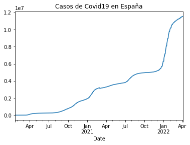
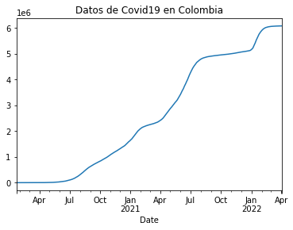
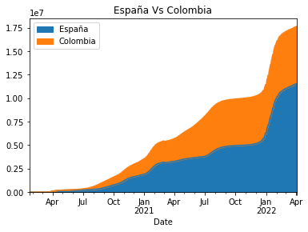
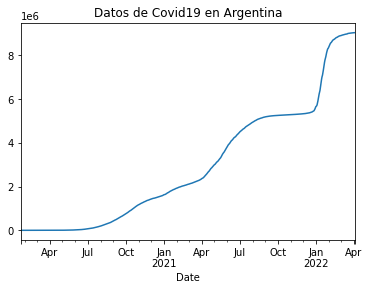
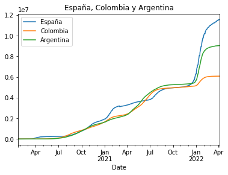
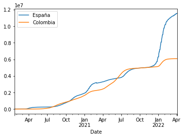

# Uso de API de Covid19 con Pandas


## Instalación Pandas

En primer lugar instalamos Pandas para poder tener las herramientas que nos van a permitir trabajar con los formatos csv, excel, sql y hdf5. Es una herramienta muy útil para trabajar con datos porque, además, nos permitirá filtrarlos y organizarlos de diferentes maneras.


```python
!pip install pandas
```

    Requirement already satisfied: pandas in c:\programdata\anaconda3\lib\site-packages (1.2.4)
    Requirement already satisfied: python-dateutil>=2.7.3 in c:\programdata\anaconda3\lib\site-packages (from pandas) (2.8.1)
    Requirement already satisfied: pytz>=2017.3 in c:\programdata\anaconda3\lib\site-packages (from pandas) (2021.1)
    Requirement already satisfied: numpy>=1.16.5 in c:\programdata\anaconda3\lib\site-packages (from pandas) (1.20.1)
    Requirement already satisfied: six>=1.5 in c:\programdata\anaconda3\lib\site-packages (from python-dateutil>=2.7.3->pandas) (1.15.0)
    

## Configuración

Es el momento de traer la biblioteca de análisis de datos a este entorno. Con este código le pedimos a Pandas que la importe. 


```python
import pandas as pd

```

## Variables 

Definimos la URL de la que queremos obtener los datos y creamos las variables que nos van a hacer falta


```python
url = 'https://api.covid19api.com/countries'
```


```python
url
```


    'https://api.covid19api.com/countries'


## Creación de Dataframe

Utilizamos la función `read_json` de Pandas para leer los datos de JSON de la API


```python
df = pd.read_json(url)
```


```python
df
```


<div>
<style scoped>
    .dataframe tbody tr th:only-of-type {
        vertical-align: middle;
    }

    .dataframe tbody tr th {
        vertical-align: top;
    }

    .dataframe thead th {
        text-align: right;
    }
</style>
<table border="1" class="dataframe">
  <thead>
    <tr style="text-align: right;">
      <th></th>
      <th>Country</th>
      <th>Slug</th>
      <th>ISO2</th>
    </tr>
  </thead>
  <tbody>
    <tr>
      <th>0</th>
      <td>Martinique</td>
      <td>martinique</td>
      <td>MQ</td>
    </tr>
    <tr>
      <th>1</th>
      <td>Uruguay</td>
      <td>uruguay</td>
      <td>UY</td>
    </tr>
    <tr>
      <th>2</th>
      <td>Kazakhstan</td>
      <td>kazakhstan</td>
      <td>KZ</td>
    </tr>
    <tr>
      <th>3</th>
      <td>Lebanon</td>
      <td>lebanon</td>
      <td>LB</td>
    </tr>
    <tr>
      <th>4</th>
      <td>Morocco</td>
      <td>morocco</td>
      <td>MA</td>
    </tr>
    <tr>
      <th>...</th>
      <td>...</td>
      <td>...</td>
      <td>...</td>
    </tr>
    <tr>
      <th>243</th>
      <td>Dominican Republic</td>
      <td>dominican-republic</td>
      <td>DO</td>
    </tr>
    <tr>
      <th>244</th>
      <td>Liberia</td>
      <td>liberia</td>
      <td>LR</td>
    </tr>
    <tr>
      <th>245</th>
      <td>Monaco</td>
      <td>monaco</td>
      <td>MC</td>
    </tr>
    <tr>
      <th>246</th>
      <td>Nigeria</td>
      <td>nigeria</td>
      <td>NG</td>
    </tr>
    <tr>
      <th>247</th>
      <td>Paraguay</td>
      <td>paraguay</td>
      <td>PY</td>
    </tr>
  </tbody>
</table>
<p>248 rows × 3 columns</p>
</div>


## Explorar tabla

- Cabecera
- Cola
- Descripción 

Con esta función podremos definir cuántas columnas quermeos ver poniendo el número entre paréntesis. Si lo dejamos vacío 
nos mostrará, por defecto, los cinco primeros valores


```python
df.head()
```


<div>
<style scoped>
    .dataframe tbody tr th:only-of-type {
        vertical-align: middle;
    }

    .dataframe tbody tr th {
        vertical-align: top;
    }

    .dataframe thead th {
        text-align: right;
    }
</style>
<table border="1" class="dataframe">
  <thead>
    <tr style="text-align: right;">
      <th></th>
      <th>Country</th>
      <th>Slug</th>
      <th>ISO2</th>
    </tr>
  </thead>
  <tbody>
    <tr>
      <th>0</th>
      <td>Martinique</td>
      <td>martinique</td>
      <td>MQ</td>
    </tr>
    <tr>
      <th>1</th>
      <td>Uruguay</td>
      <td>uruguay</td>
      <td>UY</td>
    </tr>
    <tr>
      <th>2</th>
      <td>Kazakhstan</td>
      <td>kazakhstan</td>
      <td>KZ</td>
    </tr>
    <tr>
      <th>3</th>
      <td>Lebanon</td>
      <td>lebanon</td>
      <td>LB</td>
    </tr>
    <tr>
      <th>4</th>
      <td>Morocco</td>
      <td>morocco</td>
      <td>MA</td>
    </tr>
  </tbody>
</table>
</div>


```python
df.tail()
```


<div>
<style scoped>
    .dataframe tbody tr th:only-of-type {
        vertical-align: middle;
    }

    .dataframe tbody tr th {
        vertical-align: top;
    }

    .dataframe thead th {
        text-align: right;
    }
</style>
<table border="1" class="dataframe">
  <thead>
    <tr style="text-align: right;">
      <th></th>
      <th>Country</th>
      <th>Slug</th>
      <th>ISO2</th>
    </tr>
  </thead>
  <tbody>
    <tr>
      <th>243</th>
      <td>Dominican Republic</td>
      <td>dominican-republic</td>
      <td>DO</td>
    </tr>
    <tr>
      <th>244</th>
      <td>Liberia</td>
      <td>liberia</td>
      <td>LR</td>
    </tr>
    <tr>
      <th>245</th>
      <td>Monaco</td>
      <td>monaco</td>
      <td>MC</td>
    </tr>
    <tr>
      <th>246</th>
      <td>Nigeria</td>
      <td>nigeria</td>
      <td>NG</td>
    </tr>
    <tr>
      <th>247</th>
      <td>Paraguay</td>
      <td>paraguay</td>
      <td>PY</td>
    </tr>
  </tbody>
</table>
</div>


Con la función df.info podremos visualizar un resumen del dataframe


```python
df.info()
```

    <class 'pandas.core.frame.DataFrame'>
    RangeIndex: 248 entries, 0 to 247
    Data columns (total 3 columns):
     #   Column   Non-Null Count  Dtype 
    ---  ------   --------------  ----- 
     0   Country  248 non-null    object
     1   Slug     248 non-null    object
     2   ISO2     248 non-null    object
    dtypes: object(3)
    memory usage: 5.9+ KB
    

# Acceso a datos

Seleccionamos los datos que queremos ver. Ponemos entre corchetes el nombre de las columnas que queremos que nos muestre.
En este caso elegimos los países. Si ponemos a continuación, entre corchetes también, un número de los que se encuentran dentro de la tabla nos mostrará el nombre del país que ocupa esa posición.


```python
df['Country']
```


    0              Martinique
    1                 Uruguay
    2              Kazakhstan
    3                 Lebanon
    4                 Morocco
                  ...        
    243    Dominican Republic
    244               Liberia
    245                Monaco
    246               Nigeria
    247              Paraguay
    Name: Country, Length: 248, dtype: object


```python
df['Country'][200]
```


    'Sri Lanka'


## Tiempo real España

Para conocer los datos en tiempo real utilizaremos el código url_live. Tendremos que definir también la url de la que obtendremos los datos


```python
url_live = 'https://api.covid19api.com/country/spain/status/confirmed/live'
df_es = pd.read_json(url_live)
df_es
```


<div>
<style scoped>
    .dataframe tbody tr th:only-of-type {
        vertical-align: middle;
    }

    .dataframe tbody tr th {
        vertical-align: top;
    }

    .dataframe thead th {
        text-align: right;
    }
</style>
<table border="1" class="dataframe">
  <thead>
    <tr style="text-align: right;">
      <th></th>
      <th>Country</th>
      <th>CountryCode</th>
      <th>Province</th>
      <th>City</th>
      <th>CityCode</th>
      <th>Lat</th>
      <th>Lon</th>
      <th>Cases</th>
      <th>Status</th>
      <th>Date</th>
    </tr>
  </thead>
  <tbody>
    <tr>
      <th>0</th>
      <td>Spain</td>
      <td>ES</td>
      <td></td>
      <td></td>
      <td></td>
      <td>40.46</td>
      <td>-3.75</td>
      <td>0</td>
      <td>confirmed</td>
      <td>2020-01-22 00:00:00+00:00</td>
    </tr>
    <tr>
      <th>1</th>
      <td>Spain</td>
      <td>ES</td>
      <td></td>
      <td></td>
      <td></td>
      <td>40.46</td>
      <td>-3.75</td>
      <td>0</td>
      <td>confirmed</td>
      <td>2020-01-23 00:00:00+00:00</td>
    </tr>
    <tr>
      <th>2</th>
      <td>Spain</td>
      <td>ES</td>
      <td></td>
      <td></td>
      <td></td>
      <td>40.46</td>
      <td>-3.75</td>
      <td>0</td>
      <td>confirmed</td>
      <td>2020-01-24 00:00:00+00:00</td>
    </tr>
    <tr>
      <th>3</th>
      <td>Spain</td>
      <td>ES</td>
      <td></td>
      <td></td>
      <td></td>
      <td>40.46</td>
      <td>-3.75</td>
      <td>0</td>
      <td>confirmed</td>
      <td>2020-01-25 00:00:00+00:00</td>
    </tr>
    <tr>
      <th>4</th>
      <td>Spain</td>
      <td>ES</td>
      <td></td>
      <td></td>
      <td></td>
      <td>40.46</td>
      <td>-3.75</td>
      <td>0</td>
      <td>confirmed</td>
      <td>2020-01-26 00:00:00+00:00</td>
    </tr>
    <tr>
      <th>...</th>
      <td>...</td>
      <td>...</td>
      <td>...</td>
      <td>...</td>
      <td>...</td>
      <td>...</td>
      <td>...</td>
      <td>...</td>
      <td>...</td>
      <td>...</td>
    </tr>
    <tr>
      <th>799</th>
      <td>Spain</td>
      <td>ES</td>
      <td></td>
      <td></td>
      <td></td>
      <td>40.46</td>
      <td>-3.75</td>
      <td>11508309</td>
      <td>confirmed</td>
      <td>2022-03-31 00:00:00+00:00</td>
    </tr>
    <tr>
      <th>800</th>
      <td>Spain</td>
      <td>ES</td>
      <td></td>
      <td></td>
      <td></td>
      <td>40.46</td>
      <td>-3.75</td>
      <td>11551574</td>
      <td>confirmed</td>
      <td>2022-04-01 00:00:00+00:00</td>
    </tr>
    <tr>
      <th>801</th>
      <td>Spain</td>
      <td>ES</td>
      <td></td>
      <td></td>
      <td></td>
      <td>40.46</td>
      <td>-3.75</td>
      <td>11551574</td>
      <td>confirmed</td>
      <td>2022-04-02 00:00:00+00:00</td>
    </tr>
    <tr>
      <th>802</th>
      <td>Spain</td>
      <td>ES</td>
      <td></td>
      <td></td>
      <td></td>
      <td>40.46</td>
      <td>-3.75</td>
      <td>11551574</td>
      <td>confirmed</td>
      <td>2022-04-03 00:00:00+00:00</td>
    </tr>
    <tr>
      <th>803</th>
      <td>Spain</td>
      <td>ES</td>
      <td></td>
      <td></td>
      <td></td>
      <td>40.46</td>
      <td>-3.75</td>
      <td>11551574</td>
      <td>confirmed</td>
      <td>2022-04-04 00:00:00+00:00</td>
    </tr>
  </tbody>
</table>
<p>804 rows × 10 columns</p>
</div>


Para conocer toda la información usaremos la función df_es.info


```python
df_es.info()
```

    <class 'pandas.core.frame.DataFrame'>
    RangeIndex: 804 entries, 0 to 803
    Data columns (total 10 columns):
     #   Column       Non-Null Count  Dtype              
    ---  ------       --------------  -----              
     0   Country      804 non-null    object             
     1   CountryCode  804 non-null    object             
     2   Province     804 non-null    object             
     3   City         804 non-null    object             
     4   CityCode     804 non-null    object             
     5   Lat          804 non-null    float64            
     6   Lon          804 non-null    float64            
     7   Cases        804 non-null    int64              
     8   Status       804 non-null    object             
     9   Date         804 non-null    datetime64[ns, UTC]
    dtypes: datetime64[ns, UTC](1), float64(2), int64(1), object(6)
    memory usage: 62.9+ KB
    

A continuación vamos a crear un gráfico de línea con los casos que hay en España. En primer lugar convertiremos la columna que nos muestra los datos de las fechas en la columna del índice con la función set_index. Entre paréntesis le indicaremos qué columna queremos ver primero. 


```python
df_es.set_index('Date')

```


<div>
<style scoped>
    .dataframe tbody tr th:only-of-type {
        vertical-align: middle;
    }

    .dataframe tbody tr th {
        vertical-align: top;
    }

    .dataframe thead th {
        text-align: right;
    }
</style>
<table border="1" class="dataframe">
  <thead>
    <tr style="text-align: right;">
      <th></th>
      <th>Country</th>
      <th>CountryCode</th>
      <th>Province</th>
      <th>City</th>
      <th>CityCode</th>
      <th>Lat</th>
      <th>Lon</th>
      <th>Cases</th>
      <th>Status</th>
    </tr>
    <tr>
      <th>Date</th>
      <th></th>
      <th></th>
      <th></th>
      <th></th>
      <th></th>
      <th></th>
      <th></th>
      <th></th>
      <th></th>
    </tr>
  </thead>
  <tbody>
    <tr>
      <th>2020-01-22 00:00:00+00:00</th>
      <td>Spain</td>
      <td>ES</td>
      <td></td>
      <td></td>
      <td></td>
      <td>40.46</td>
      <td>-3.75</td>
      <td>0</td>
      <td>confirmed</td>
    </tr>
    <tr>
      <th>2020-01-23 00:00:00+00:00</th>
      <td>Spain</td>
      <td>ES</td>
      <td></td>
      <td></td>
      <td></td>
      <td>40.46</td>
      <td>-3.75</td>
      <td>0</td>
      <td>confirmed</td>
    </tr>
    <tr>
      <th>2020-01-24 00:00:00+00:00</th>
      <td>Spain</td>
      <td>ES</td>
      <td></td>
      <td></td>
      <td></td>
      <td>40.46</td>
      <td>-3.75</td>
      <td>0</td>
      <td>confirmed</td>
    </tr>
    <tr>
      <th>2020-01-25 00:00:00+00:00</th>
      <td>Spain</td>
      <td>ES</td>
      <td></td>
      <td></td>
      <td></td>
      <td>40.46</td>
      <td>-3.75</td>
      <td>0</td>
      <td>confirmed</td>
    </tr>
    <tr>
      <th>2020-01-26 00:00:00+00:00</th>
      <td>Spain</td>
      <td>ES</td>
      <td></td>
      <td></td>
      <td></td>
      <td>40.46</td>
      <td>-3.75</td>
      <td>0</td>
      <td>confirmed</td>
    </tr>
    <tr>
      <th>...</th>
      <td>...</td>
      <td>...</td>
      <td>...</td>
      <td>...</td>
      <td>...</td>
      <td>...</td>
      <td>...</td>
      <td>...</td>
      <td>...</td>
    </tr>
    <tr>
      <th>2022-03-31 00:00:00+00:00</th>
      <td>Spain</td>
      <td>ES</td>
      <td></td>
      <td></td>
      <td></td>
      <td>40.46</td>
      <td>-3.75</td>
      <td>11508309</td>
      <td>confirmed</td>
    </tr>
    <tr>
      <th>2022-04-01 00:00:00+00:00</th>
      <td>Spain</td>
      <td>ES</td>
      <td></td>
      <td></td>
      <td></td>
      <td>40.46</td>
      <td>-3.75</td>
      <td>11551574</td>
      <td>confirmed</td>
    </tr>
    <tr>
      <th>2022-04-02 00:00:00+00:00</th>
      <td>Spain</td>
      <td>ES</td>
      <td></td>
      <td></td>
      <td></td>
      <td>40.46</td>
      <td>-3.75</td>
      <td>11551574</td>
      <td>confirmed</td>
    </tr>
    <tr>
      <th>2022-04-03 00:00:00+00:00</th>
      <td>Spain</td>
      <td>ES</td>
      <td></td>
      <td></td>
      <td></td>
      <td>40.46</td>
      <td>-3.75</td>
      <td>11551574</td>
      <td>confirmed</td>
    </tr>
    <tr>
      <th>2022-04-04 00:00:00+00:00</th>
      <td>Spain</td>
      <td>ES</td>
      <td></td>
      <td></td>
      <td></td>
      <td>40.46</td>
      <td>-3.75</td>
      <td>11551574</td>
      <td>confirmed</td>
    </tr>
  </tbody>
</table>
<p>804 rows × 9 columns</p>
</div>


Añadiremos entre corchetes el siguiente valor que queremos que nos muestre.


```python
df_es.set_index('Date')['Cases']
```


    Date
    2020-01-22 00:00:00+00:00           0
    2020-01-23 00:00:00+00:00           0
    2020-01-24 00:00:00+00:00           0
    2020-01-25 00:00:00+00:00           0
    2020-01-26 00:00:00+00:00           0
                                   ...   
    2022-03-31 00:00:00+00:00    11508309
    2022-04-01 00:00:00+00:00    11551574
    2022-04-02 00:00:00+00:00    11551574
    2022-04-03 00:00:00+00:00    11551574
    2022-04-04 00:00:00+00:00    11551574
    Name: Cases, Length: 804, dtype: int64


Para grear la gráfica usaremos la siguiente fórmula. 


```python
df_es.set_index('Date')['Cases'].plot(title="Casos de Covid19 en España")
```


    <AxesSubplot:title={'center':'Casos de Covid19 en España'}, xlabel='Date'>


    

    


## Tiempo real Colombia

Cambiando la variable es por la variable co, podremos observar los datos de Colombia. Usamos co porque es la variable correspondiente a ese país, si quisiéramos ver otro usaríamos otra variable.


```python
url_co = 'https://api.covid19api.com/country/colombia/status/confirmed/live'
df_co = pd.read_json(url_co)
df_co.set_index('Date')['Cases'].plot(title="Datos de Covid19 en Colombia")
```


    <AxesSubplot:title={'center':'Datos de Covid19 en Colombia'}, xlabel='Date'>


    

    


## Comparativa España-Colombia

Escribiendo ambas variables así podremos comparar los datos de ambos países.


```python
casos_es = df_es.set_index('Date')['Cases']
casos_co = df_co.set_index('Date')['Cases']
```


```python
casos_es
```


    Date
    2020-01-22 00:00:00+00:00           0
    2020-01-23 00:00:00+00:00           0
    2020-01-24 00:00:00+00:00           0
    2020-01-25 00:00:00+00:00           0
    2020-01-26 00:00:00+00:00           0
                                   ...   
    2022-03-31 00:00:00+00:00    11508309
    2022-04-01 00:00:00+00:00    11551574
    2022-04-02 00:00:00+00:00    11551574
    2022-04-03 00:00:00+00:00    11551574
    2022-04-04 00:00:00+00:00    11551574
    Name: Cases, Length: 804, dtype: int64


```python
casos_co
```


    Date
    2020-01-22 00:00:00+00:00          0
    2020-01-23 00:00:00+00:00          0
    2020-01-24 00:00:00+00:00          0
    2020-01-25 00:00:00+00:00          0
    2020-01-26 00:00:00+00:00          0
                                  ...   
    2022-03-31 00:00:00+00:00    6084916
    2022-04-01 00:00:00+00:00    6085270
    2022-04-02 00:00:00+00:00    6085618
    2022-04-03 00:00:00+00:00    6085926
    2022-04-04 00:00:00+00:00    6086233
    Name: Cases, Length: 804, dtype: int64


```python
pd.concat([casos_es,casos_co],axis=1)
```


<div>
<style scoped>
    .dataframe tbody tr th:only-of-type {
        vertical-align: middle;
    }

    .dataframe tbody tr th {
        vertical-align: top;
    }

    .dataframe thead th {
        text-align: right;
    }
</style>
<table border="1" class="dataframe">
  <thead>
    <tr style="text-align: right;">
      <th></th>
      <th>Cases</th>
      <th>Cases</th>
    </tr>
    <tr>
      <th>Date</th>
      <th></th>
      <th></th>
    </tr>
  </thead>
  <tbody>
    <tr>
      <th>2020-01-22 00:00:00+00:00</th>
      <td>0</td>
      <td>0</td>
    </tr>
    <tr>
      <th>2020-01-23 00:00:00+00:00</th>
      <td>0</td>
      <td>0</td>
    </tr>
    <tr>
      <th>2020-01-24 00:00:00+00:00</th>
      <td>0</td>
      <td>0</td>
    </tr>
    <tr>
      <th>2020-01-25 00:00:00+00:00</th>
      <td>0</td>
      <td>0</td>
    </tr>
    <tr>
      <th>2020-01-26 00:00:00+00:00</th>
      <td>0</td>
      <td>0</td>
    </tr>
    <tr>
      <th>...</th>
      <td>...</td>
      <td>...</td>
    </tr>
    <tr>
      <th>2022-03-31 00:00:00+00:00</th>
      <td>11508309</td>
      <td>6084916</td>
    </tr>
    <tr>
      <th>2022-04-01 00:00:00+00:00</th>
      <td>11551574</td>
      <td>6085270</td>
    </tr>
    <tr>
      <th>2022-04-02 00:00:00+00:00</th>
      <td>11551574</td>
      <td>6085618</td>
    </tr>
    <tr>
      <th>2022-04-03 00:00:00+00:00</th>
      <td>11551574</td>
      <td>6085926</td>
    </tr>
    <tr>
      <th>2022-04-04 00:00:00+00:00</th>
      <td>11551574</td>
      <td>6086233</td>
    </tr>
  </tbody>
</table>
<p>804 rows × 2 columns</p>
</div>


```python
vs = pd.concat([casos_es,casos_co],axis=1)
vs
```


<div>
<style scoped>
    .dataframe tbody tr th:only-of-type {
        vertical-align: middle;
    }

    .dataframe tbody tr th {
        vertical-align: top;
    }

    .dataframe thead th {
        text-align: right;
    }
</style>
<table border="1" class="dataframe">
  <thead>
    <tr style="text-align: right;">
      <th></th>
      <th>Cases</th>
      <th>Cases</th>
    </tr>
    <tr>
      <th>Date</th>
      <th></th>
      <th></th>
    </tr>
  </thead>
  <tbody>
    <tr>
      <th>2020-01-22 00:00:00+00:00</th>
      <td>0</td>
      <td>0</td>
    </tr>
    <tr>
      <th>2020-01-23 00:00:00+00:00</th>
      <td>0</td>
      <td>0</td>
    </tr>
    <tr>
      <th>2020-01-24 00:00:00+00:00</th>
      <td>0</td>
      <td>0</td>
    </tr>
    <tr>
      <th>2020-01-25 00:00:00+00:00</th>
      <td>0</td>
      <td>0</td>
    </tr>
    <tr>
      <th>2020-01-26 00:00:00+00:00</th>
      <td>0</td>
      <td>0</td>
    </tr>
    <tr>
      <th>...</th>
      <td>...</td>
      <td>...</td>
    </tr>
    <tr>
      <th>2022-03-31 00:00:00+00:00</th>
      <td>11508309</td>
      <td>6084916</td>
    </tr>
    <tr>
      <th>2022-04-01 00:00:00+00:00</th>
      <td>11551574</td>
      <td>6085270</td>
    </tr>
    <tr>
      <th>2022-04-02 00:00:00+00:00</th>
      <td>11551574</td>
      <td>6085618</td>
    </tr>
    <tr>
      <th>2022-04-03 00:00:00+00:00</th>
      <td>11551574</td>
      <td>6085926</td>
    </tr>
    <tr>
      <th>2022-04-04 00:00:00+00:00</th>
      <td>11551574</td>
      <td>6086233</td>
    </tr>
  </tbody>
</table>
<p>804 rows × 2 columns</p>
</div>


Con esta función indicaremos que siempre que la ejecutemos nos muestre los datos de ambos países para no tener que ir repitiéndolo siempre que queramos verlo.


```python
vs.columns = ['España','Colombia']
vs
```


<div>
<style scoped>
    .dataframe tbody tr th:only-of-type {
        vertical-align: middle;
    }

    .dataframe tbody tr th {
        vertical-align: top;
    }

    .dataframe thead th {
        text-align: right;
    }
</style>
<table border="1" class="dataframe">
  <thead>
    <tr style="text-align: right;">
      <th></th>
      <th>España</th>
      <th>Colombia</th>
    </tr>
    <tr>
      <th>Date</th>
      <th></th>
      <th></th>
    </tr>
  </thead>
  <tbody>
    <tr>
      <th>2020-01-22 00:00:00+00:00</th>
      <td>0</td>
      <td>0</td>
    </tr>
    <tr>
      <th>2020-01-23 00:00:00+00:00</th>
      <td>0</td>
      <td>0</td>
    </tr>
    <tr>
      <th>2020-01-24 00:00:00+00:00</th>
      <td>0</td>
      <td>0</td>
    </tr>
    <tr>
      <th>2020-01-25 00:00:00+00:00</th>
      <td>0</td>
      <td>0</td>
    </tr>
    <tr>
      <th>2020-01-26 00:00:00+00:00</th>
      <td>0</td>
      <td>0</td>
    </tr>
    <tr>
      <th>...</th>
      <td>...</td>
      <td>...</td>
    </tr>
    <tr>
      <th>2022-03-31 00:00:00+00:00</th>
      <td>11508309</td>
      <td>6084916</td>
    </tr>
    <tr>
      <th>2022-04-01 00:00:00+00:00</th>
      <td>11551574</td>
      <td>6085270</td>
    </tr>
    <tr>
      <th>2022-04-02 00:00:00+00:00</th>
      <td>11551574</td>
      <td>6085618</td>
    </tr>
    <tr>
      <th>2022-04-03 00:00:00+00:00</th>
      <td>11551574</td>
      <td>6085926</td>
    </tr>
    <tr>
      <th>2022-04-04 00:00:00+00:00</th>
      <td>11551574</td>
      <td>6086233</td>
    </tr>
  </tbody>
</table>
<p>804 rows × 2 columns</p>
</div>


Añadimos tras el paréntesis del plot la variable kind para observar que hay diferentes formas de crear gráficas. 


```python
vs.plot(title="España Vs Colombia", kind='area')
```


    <AxesSubplot:title={'center':'España Vs Colombia'}, xlabel='Date'>


    

    


## Triple comparativa

Podemos meter un tercer país en la comparativa. En este caso, Argentina. Mostramos los datos igual que hemos hecho antes con los de Colombia.


```python
url_arg = 'https://api.covid19api.com/country/argentina/status/confirmed/live'
df_arg = pd.read_json(url_arg)
df_arg.set_index('Date')['Cases'].plot(title="Datos de Covid19 en Argentina")
```


    <AxesSubplot:title={'center':'Datos de Covid19 en Argentina'}, xlabel='Date'>


    

    


```python
casos_es = df_es.set_index('Date')['Cases']
casos_co = df_co.set_index('Date')['Cases']
casos_arg = df_arg.set_index('Date')['Cases']
```


```python
casos_arg
```


    Date
    2020-01-22 00:00:00+00:00          0
    2020-01-23 00:00:00+00:00          0
    2020-01-24 00:00:00+00:00          0
    2020-01-25 00:00:00+00:00          0
    2020-01-26 00:00:00+00:00          0
                                  ...   
    2022-04-01 00:00:00+00:00    9039838
    2022-04-02 00:00:00+00:00    9040640
    2022-04-03 00:00:00+00:00    9041124
    2022-04-04 00:00:00+00:00    9043098
    2022-04-05 00:00:00+00:00    9043098
    Name: Cases, Length: 805, dtype: int64


Es importante usar esta función para que nos muestre los tres datos juntos. 


```python
pd.concat([casos_es,casos_co,casos_arg],axis=1)
```


<div>
<style scoped>
    .dataframe tbody tr th:only-of-type {
        vertical-align: middle;
    }

    .dataframe tbody tr th {
        vertical-align: top;
    }

    .dataframe thead th {
        text-align: right;
    }
</style>
<table border="1" class="dataframe">
  <thead>
    <tr style="text-align: right;">
      <th></th>
      <th>Cases</th>
      <th>Cases</th>
      <th>Cases</th>
    </tr>
    <tr>
      <th>Date</th>
      <th></th>
      <th></th>
      <th></th>
    </tr>
  </thead>
  <tbody>
    <tr>
      <th>2020-01-22 00:00:00+00:00</th>
      <td>0.0</td>
      <td>0.0</td>
      <td>0</td>
    </tr>
    <tr>
      <th>2020-01-23 00:00:00+00:00</th>
      <td>0.0</td>
      <td>0.0</td>
      <td>0</td>
    </tr>
    <tr>
      <th>2020-01-24 00:00:00+00:00</th>
      <td>0.0</td>
      <td>0.0</td>
      <td>0</td>
    </tr>
    <tr>
      <th>2020-01-25 00:00:00+00:00</th>
      <td>0.0</td>
      <td>0.0</td>
      <td>0</td>
    </tr>
    <tr>
      <th>2020-01-26 00:00:00+00:00</th>
      <td>0.0</td>
      <td>0.0</td>
      <td>0</td>
    </tr>
    <tr>
      <th>...</th>
      <td>...</td>
      <td>...</td>
      <td>...</td>
    </tr>
    <tr>
      <th>2022-04-01 00:00:00+00:00</th>
      <td>11551574.0</td>
      <td>6085270.0</td>
      <td>9039838</td>
    </tr>
    <tr>
      <th>2022-04-02 00:00:00+00:00</th>
      <td>11551574.0</td>
      <td>6085618.0</td>
      <td>9040640</td>
    </tr>
    <tr>
      <th>2022-04-03 00:00:00+00:00</th>
      <td>11551574.0</td>
      <td>6085926.0</td>
      <td>9041124</td>
    </tr>
    <tr>
      <th>2022-04-04 00:00:00+00:00</th>
      <td>11551574.0</td>
      <td>6086233.0</td>
      <td>9043098</td>
    </tr>
    <tr>
      <th>2022-04-05 00:00:00+00:00</th>
      <td>NaN</td>
      <td>NaN</td>
      <td>9043098</td>
    </tr>
  </tbody>
</table>
<p>805 rows × 3 columns</p>
</div>


Damos nombre a la concatenación de datos para crear la gráfica más adelante.


```python
vs1 = pd.concat([casos_es,casos_co,casos_arg],axis=1)
vs1
```


<div>
<style scoped>
    .dataframe tbody tr th:only-of-type {
        vertical-align: middle;
    }

    .dataframe tbody tr th {
        vertical-align: top;
    }

    .dataframe thead th {
        text-align: right;
    }
</style>
<table border="1" class="dataframe">
  <thead>
    <tr style="text-align: right;">
      <th></th>
      <th>Cases</th>
      <th>Cases</th>
      <th>Cases</th>
    </tr>
    <tr>
      <th>Date</th>
      <th></th>
      <th></th>
      <th></th>
    </tr>
  </thead>
  <tbody>
    <tr>
      <th>2020-01-22 00:00:00+00:00</th>
      <td>0.0</td>
      <td>0.0</td>
      <td>0</td>
    </tr>
    <tr>
      <th>2020-01-23 00:00:00+00:00</th>
      <td>0.0</td>
      <td>0.0</td>
      <td>0</td>
    </tr>
    <tr>
      <th>2020-01-24 00:00:00+00:00</th>
      <td>0.0</td>
      <td>0.0</td>
      <td>0</td>
    </tr>
    <tr>
      <th>2020-01-25 00:00:00+00:00</th>
      <td>0.0</td>
      <td>0.0</td>
      <td>0</td>
    </tr>
    <tr>
      <th>2020-01-26 00:00:00+00:00</th>
      <td>0.0</td>
      <td>0.0</td>
      <td>0</td>
    </tr>
    <tr>
      <th>...</th>
      <td>...</td>
      <td>...</td>
      <td>...</td>
    </tr>
    <tr>
      <th>2022-04-01 00:00:00+00:00</th>
      <td>11551574.0</td>
      <td>6085270.0</td>
      <td>9039838</td>
    </tr>
    <tr>
      <th>2022-04-02 00:00:00+00:00</th>
      <td>11551574.0</td>
      <td>6085618.0</td>
      <td>9040640</td>
    </tr>
    <tr>
      <th>2022-04-03 00:00:00+00:00</th>
      <td>11551574.0</td>
      <td>6085926.0</td>
      <td>9041124</td>
    </tr>
    <tr>
      <th>2022-04-04 00:00:00+00:00</th>
      <td>11551574.0</td>
      <td>6086233.0</td>
      <td>9043098</td>
    </tr>
    <tr>
      <th>2022-04-05 00:00:00+00:00</th>
      <td>NaN</td>
      <td>NaN</td>
      <td>9043098</td>
    </tr>
  </tbody>
</table>
<p>805 rows × 3 columns</p>
</div>


```python
vs1.columns = ['España','Colombia','Argentina']
vs1
```


<div>
<style scoped>
    .dataframe tbody tr th:only-of-type {
        vertical-align: middle;
    }

    .dataframe tbody tr th {
        vertical-align: top;
    }

    .dataframe thead th {
        text-align: right;
    }
</style>
<table border="1" class="dataframe">
  <thead>
    <tr style="text-align: right;">
      <th></th>
      <th>España</th>
      <th>Colombia</th>
      <th>Argentina</th>
    </tr>
    <tr>
      <th>Date</th>
      <th></th>
      <th></th>
      <th></th>
    </tr>
  </thead>
  <tbody>
    <tr>
      <th>2020-01-22 00:00:00+00:00</th>
      <td>0.0</td>
      <td>0.0</td>
      <td>0</td>
    </tr>
    <tr>
      <th>2020-01-23 00:00:00+00:00</th>
      <td>0.0</td>
      <td>0.0</td>
      <td>0</td>
    </tr>
    <tr>
      <th>2020-01-24 00:00:00+00:00</th>
      <td>0.0</td>
      <td>0.0</td>
      <td>0</td>
    </tr>
    <tr>
      <th>2020-01-25 00:00:00+00:00</th>
      <td>0.0</td>
      <td>0.0</td>
      <td>0</td>
    </tr>
    <tr>
      <th>2020-01-26 00:00:00+00:00</th>
      <td>0.0</td>
      <td>0.0</td>
      <td>0</td>
    </tr>
    <tr>
      <th>...</th>
      <td>...</td>
      <td>...</td>
      <td>...</td>
    </tr>
    <tr>
      <th>2022-04-01 00:00:00+00:00</th>
      <td>11551574.0</td>
      <td>6085270.0</td>
      <td>9039838</td>
    </tr>
    <tr>
      <th>2022-04-02 00:00:00+00:00</th>
      <td>11551574.0</td>
      <td>6085618.0</td>
      <td>9040640</td>
    </tr>
    <tr>
      <th>2022-04-03 00:00:00+00:00</th>
      <td>11551574.0</td>
      <td>6085926.0</td>
      <td>9041124</td>
    </tr>
    <tr>
      <th>2022-04-04 00:00:00+00:00</th>
      <td>11551574.0</td>
      <td>6086233.0</td>
      <td>9043098</td>
    </tr>
    <tr>
      <th>2022-04-05 00:00:00+00:00</th>
      <td>NaN</td>
      <td>NaN</td>
      <td>9043098</td>
    </tr>
  </tbody>
</table>
<p>805 rows × 3 columns</p>
</div>


Como anteriormente hemos dado a la concatenación de datos el nombre vs1, le pedimos que cree la gráfica


```python
vs1.plot(title="España, Colombia y Argentina")
```


    <AxesSubplot:title={'center':'España, Colombia y Argentina'}, xlabel='Date'>


    

    


## Seleccionar más columnas


```python
df_es.set_index('Date')[['Cases','Lon']]
```


<div>
<style scoped>
    .dataframe tbody tr th:only-of-type {
        vertical-align: middle;
    }

    .dataframe tbody tr th {
        vertical-align: top;
    }

    .dataframe thead th {
        text-align: right;
    }
</style>
<table border="1" class="dataframe">
  <thead>
    <tr style="text-align: right;">
      <th></th>
      <th>Cases</th>
      <th>Lon</th>
    </tr>
    <tr>
      <th>Date</th>
      <th></th>
      <th></th>
    </tr>
  </thead>
  <tbody>
    <tr>
      <th>2020-01-22 00:00:00+00:00</th>
      <td>0</td>
      <td>-3.75</td>
    </tr>
    <tr>
      <th>2020-01-23 00:00:00+00:00</th>
      <td>0</td>
      <td>-3.75</td>
    </tr>
    <tr>
      <th>2020-01-24 00:00:00+00:00</th>
      <td>0</td>
      <td>-3.75</td>
    </tr>
    <tr>
      <th>2020-01-25 00:00:00+00:00</th>
      <td>0</td>
      <td>-3.75</td>
    </tr>
    <tr>
      <th>2020-01-26 00:00:00+00:00</th>
      <td>0</td>
      <td>-3.75</td>
    </tr>
    <tr>
      <th>...</th>
      <td>...</td>
      <td>...</td>
    </tr>
    <tr>
      <th>2022-03-31 00:00:00+00:00</th>
      <td>11508309</td>
      <td>-3.75</td>
    </tr>
    <tr>
      <th>2022-04-01 00:00:00+00:00</th>
      <td>11551574</td>
      <td>-3.75</td>
    </tr>
    <tr>
      <th>2022-04-02 00:00:00+00:00</th>
      <td>11551574</td>
      <td>-3.75</td>
    </tr>
    <tr>
      <th>2022-04-03 00:00:00+00:00</th>
      <td>11551574</td>
      <td>-3.75</td>
    </tr>
    <tr>
      <th>2022-04-04 00:00:00+00:00</th>
      <td>11551574</td>
      <td>-3.75</td>
    </tr>
  </tbody>
</table>
<p>804 rows × 2 columns</p>
</div>


## Exportar datos

Para guardar los datos en un archivo csv utilizaremos esta función. Es importante indicarle, en primer lugar, qué gráfica queremos que nos muestre. 


```python
vs.to_csv('vs.csv')
```

Con la siguiente fórmula podremos exportar la gráfica en un archivo png


```python
grafico = vs.plot()
fig = grafico.get_figure()
fig.savefig("vs.png")
```


    

    


```python
grafico = vs1.plot()
fig = grafico.get_figure()
fig.savefig("vs1.png")
```


    

    


```python

```
